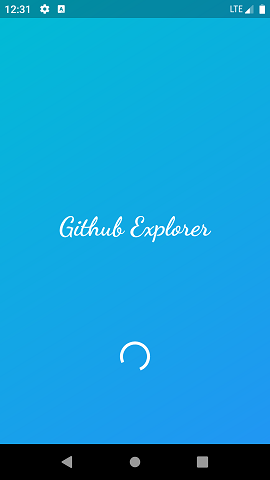
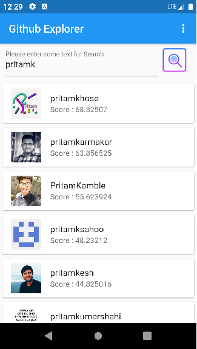
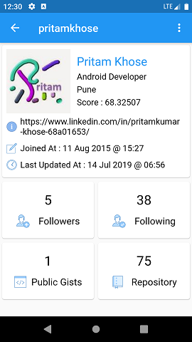
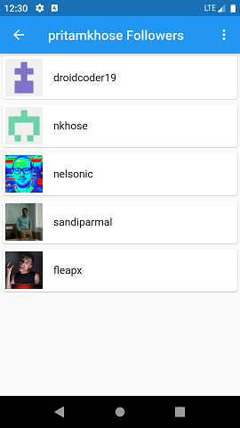
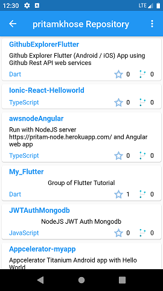

# Github Explorer Flutter
Github Explorer Flutter (Android / iOS) App using Github Rest API web services.

Introduction
------------
The goal of this flutter application is to implement interface with Github REST API web service.
It provide feature like search User's and it's details, along with list of user's Repositories, Followers and Following.

Getting Started
---------------
* If you are new to Flutter, please first follow the **Install** instructions in the [Flutter Getting Started](https://flutter.io/docs/get-started/install) guide to setup your Flutter development environment.
* Clone this repo (if you have not already):
  `git clone https://github.com/pritamkhose/GithubExplorerFlutter.git`

Github Documentation
---------
The official [Github Documentation REST API v3](https://developer.github.com/v3/) in details.

Screenshots
-----------

Flutter Docs
--------------
For help getting started with Flutter, view Flutter's online
[documentation](http://flutter.io/).

Libraries Used
--------------
  * [http][21] fetching text JSON data and images via HTTP REST client
  * [splashscreen][22] for showing splash screen
  * [flutter_custom_tabs][23] for launching URLs in our application
  * [url_launcher][24] to consume JSON data via HTTP REST client
  * [share][25] to share intent of another apps
  * [intl][26] simple example of i18n support in Flutter
  * [connectivity][27] for check network connnection

[21]: https://pub.dev/packages/http
[22]: https://pub.dev/packages/splashscreen
[23]: https://pub.dev/packages/flutter_custom_tabs
[24]: https://pub.dev/packages/url_launcher
[25]: https://pub.dev/packages/share
[26]: https://pub.dev/packages/intl
[27]: https://pub.dev/packages/connectivity

# License

    Copyright 2019 Pritam Khose

    Licensed under the Apache License, Version 2.0 (the "License");
    you may not use this file except in compliance with the License.
    You may obtain a copy of the License at

       http://www.apache.org/licenses/LICENSE-2.0

    Unless required by applicable law or agreed to in writing, software
    distributed under the License is distributed on an "AS IS" BASIS,
    WITHOUT WARRANTIES OR CONDITIONS OF ANY KIND, either express or implied.
    See the License for the specific language governing permissions and
    limitations under the License.

